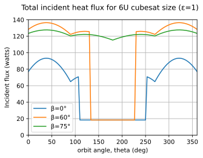

# SatelliteTemperature

## Equations of heat flux impinging on a satellite in low earth orbit

Much of the Python code here is adapted from [Rickman, NASA 2014](https://tfaws.nasa.gov/wp-content/uploads/On-Orbit_Thermal_Environments_TFAWS_2014.pdf). The file [ThermalAnalysis.py](https://github.com/mmignard/SatelliteTemperature/blob/main/ThermalAnalysis.py) contains the working functions. File {EquationVerification.py](https://github.com/mmignard/SatelliteTemperature/blob/main/EquationVerification.py) duplicates several of the graphs in the Rickman presentation. For instance, compare the graph below to the graphs on page 131 and 132 of the presentation. The file [ThermalAnalysisTest.py](https://github.com/mmignard/SatelliteTemperature/blob/main/ThermalAnalysisTest.py) was used to generate the plot shown in this readme.

However, the code extends the equations to consider emissivity at different wavelengths of light. The graph below shows the spectra of light emitted by the sun and by the earth. It is a linear plot where the two curves have been arbitrarily scaled so it can be seen that the sun emits mostly visible light, and the earth mostly emits long wave infrared light (see https://en.wikipedia.org/wiki/Black_body and https://en.wikipedia.org/wiki/Ultraviolet_catastrophe).

A logarithmic graph such as below is necessary to really compare the magnitudes of the two emission spectra. The earth emission is about 100x lower than the sun.

## Temperature of a satellite

When light hits an object, the light will be reflected, transmitted, or absorbed. For conservation of energy, the sum of those three must equal one. Transparent objects such as glass will reflect a small part of the light, and transmit almost all of the remainder. They do not absorb very much light. An opaque material such as aluminum does not transmit any of the light. All of it is reflected or absorbed, and if the fraction reflected is R, then by conservation of energy, A = 1-R is absorbed and heats up the aluminum. Interestingly, R depends on the wavelength. For instance, black anodized aluminum absorbs visible light, but it reflects long wave infrared. 

[Kirchhoff's Law of thermal radiation](https://en.wikipedia.org/wiki/Kirchhoff%27s_law_of_thermal_radiation) states that the emissivity (ε) of an object (its ability to emit light) is equal to its absorptivity. So, ε = A = 1-R. But remember that R is wavelength dependant. Some people like to distinguish short wave absorptivity (α) from long wave emissivity (ε). I rather dislike that because they are the exact same thing. Kirchhoff's Law makes intuitive sense. If the absorbed and emitted light is different, then there is a net heat flow and the temperature of the object will change until it eventually settles into a steady state where absorbed and emitted light are equal.

Black anodized aluminum is about the hottest object you will ever find laying out in the sun because it absorbs all the visible light from the sun, but because it is reflective in thermal infrared, it cannot emit that heat so it gets very hot. Teflon is the opposite. It reflects most visible light (it is white), but Teflon absorbs much of the thermal infrared, so it is a reasonably good emitter at temperatures we normally encounter on Earth. see table 5.1 on page 62 of [Small Satellite Thermal Modeling Guide](https://apps.dtic.mil/sti/pdfs/AD1170386.pdf) for examples of $&alpha;$ and $&epsilon;$

Multiplying the area of each side by the heat flux for that side, then summing the results over all six sides of a retangular satellite (in this example a 6U cubesat size), we get the total heat flux incident on the satellite. The results are shown below for several β angles (β is the inclination of the satellite orbit plane with respect to the sun).

To estimate the temperature of the satellite we can write a heat flux balance equation: $\dot Q_{out} = \dot Q_{in} + P_{gen}$. The graph above gives the value for $\dot Q_{in}$. The power generated locally by electronics is $P_{gen}$, and the only outlet for heat in orbit is through radiation, so $\dot Q_{out} = &epsilon; k_{sb} AT^4$ where $&epsilon;$ is the emissivity, $k_{sb}$ is the Stephan-Boltzman constant, A is the area of the satellite, and T is the temperature. I ignore the small heat flux due to the background temperature of space at 3K since it is microwatts. To get temperature, solve for T in $&epsilon; k_{sb} AT^4 = \dot Q_{in} + P_{gen}$. The result is shown in the figure below.

## Time dependant temperature change
The previous image showed what the satellite temperature would be if it was held in position at each point in its orbit long enough to equilibrate. Of course the satellite is constantly moving, so the temperature will continuously change. We can estimate the time-dependent temperature using the formula
$$&rho; V C_p \frac{\partial T}{\partial t} = \dot Q_{in} + P_{gen} - ε_L k_{sb} A T^4$$

$$T = \frac{1}{&rho; V C_p}\int{\big(\dot Q_{in} + P_{gen} - ε_L k_{sb} A T^4 \big) dt}$$
where $&rho;$ = density, $C_p$ = specific heat capacity (J/(m^3ˑK)), V = volume, A = surface area, $k_{sb}$ = Stefan-Boltzmann constant (W/(m^2ˑK^4)), and $P_{gen}$ is the power generated locally in the satellite

The value of 'T' is what we want to solve for, and it appears on both sides of the equation. Just assume an initial value of T for the first iteration, and after a few steps of plugging the calculated value of T back into $T^4$ it rapidly converges. 
This simulation uses values of $C_p = 230J/(kgˑK)$, $\rho = 0.7g/cm^3$, which assumes a fourth the volume is aluminum, and the rest is vacuum. 

Some tables of specific heat for various materials are here: 
- [Engineering Toolbox](https://www.engineeringtoolbox.com/specific-heat-capacity-d_391.html)
- [Engineers Edge-metals](https://www.engineersedge.com/materials/specific_heat_capacity_of_metals_13259.htm)
- [Engineers Edge-nonmetals](https://www.engineersedge.com/heat_transfer/thermal_properties_of_nonmetals_13967.htm)

The image below shows the time-dependent temperature of a satellite. The lines labelled min & max are from the peaks in the previous image (with beta=0).

## Multilayer insulation

